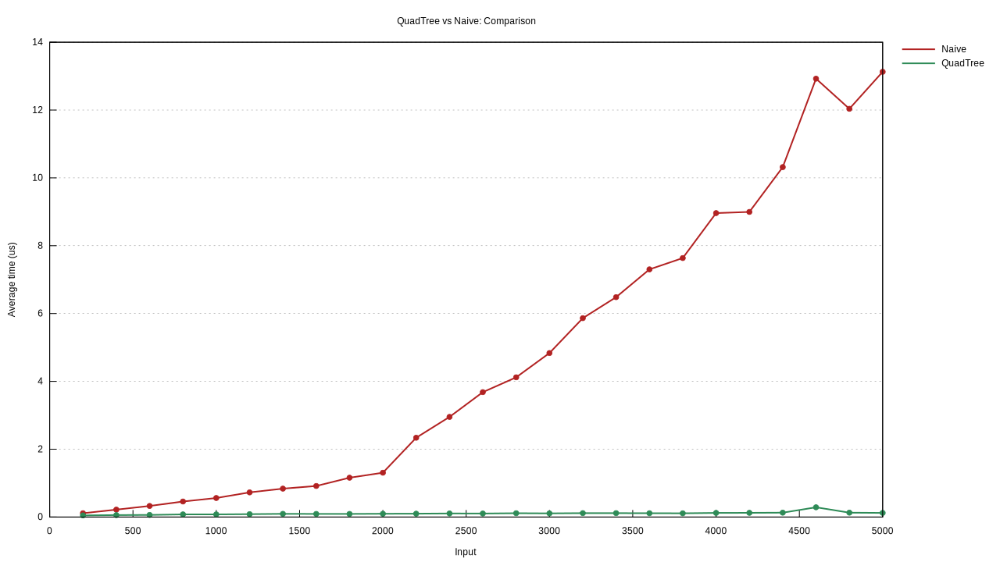

# QuadTree

Implementation of a Quadtree in Rust.


## Problem it solves

Say you have a number of points plotted in a 2D space. A vec of `Point(x, y)`
if you will. A Quadtree then solves the problem of asking, for all the points
lying within a certain space.

```
Y

┃   •                                               •
┃                       •                                            •
┃                •             •                           •
┃                                  ┌───────────────────────┐
┃                                  │      ●                │
┃    •                             │ ●                  ●  │
┃                  •               │                       │
┃            •            •        │              ●        │         •
┃                   •              │           ●           │
┃    •                             │     ●                 │
┃                                  └───────────────────────┘   •
┃
┗━━━━━━━━━━━━━━━━━━━━━━━━━━━━━━━━━━━━━━━━━━━━━━━━━━━━━━━━━━━━━━━━━━━━━━━━━━━━ X
```


```rs
// A point is just a tuple of two numbers. Say we have many of those...
let all_points = vec![(1, 2), (43, 911), ... ];

// The QuadTree needs to know its dimensions.
let x1 = 0;
let x2 = 1000;
let y1 = 0;
let y2 = 1000;

// Create a new 1000x1000 quadtree.
let mut quad_tree = QuadTree::new((x1, x2, y1, y2));

for point in all_points {
    quad_tree.insert(point);
}

// Get all the points within the 50x50 boundary box.
let found_points = quad_tree.search((40, 90, 40, 90));
```


## Status

I wrote this on a Friday evening and half a Saturday after [reading a blog post
on them](https://chidiwilliams.com/quadtrees/). I just read about the algorithm
and thought it'd be fun to implement in Rust because 1) recursive structures
aren't always that easy in Rust, 2) I haven't done much with benchmarking, and
3) I wanted it to be generic enough to hold any number type (it is, and you can
even extend it with your own type if you so desire).

I did not add this to crates.io.


## License

MIT.

Honestly I'd just copy the file into my own project if I needed something like
this.

Please star it if you use it. It's always nice to know someone found your thing
and found it useful. :)


## Benchmarks

There are benchmarks written for Criterion. Here is a screenshot (I hope) of a
run vs a naive implementation that just scans all points when searching.



